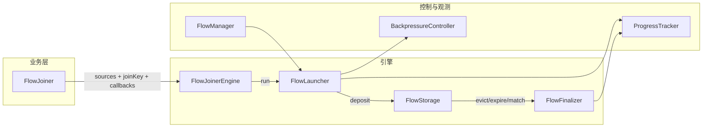

# flow 包作用分析

## 一、包的整体定位

**flow 包实现了一个「流式数据聚合引擎」（Flow Joiner Engine）**，核心用途是：

- **多源流式数据按 Key 对齐/聚合**：来自 `Stream<Stream<T>>` 的数据项，按业务定义的 `joinKey(T)` 进入存储；相同 Key 可触发**配对回调**（双流对齐）或**覆盖+旧项失败回调**（去重/只保留最新）。
- **背压与全局并发控制**：存储满时阻塞生产者；消费端通过全局信号量 + 公平份额限制并发，避免单 Job 占满资源。
- **进度与可观测性**：基于「生产许可、入库、活跃消费、主动/被动出口、物理终结」等物理水位，提供完成率、成功率、Stuck 数、TPS 等指标。

因此，你的用途可以概括为：**在流式、高并发的数据源（如扫描目录产生多个子流、或请求/响应双流）上，按 Key 做配对或去重，并在受控的并发与背压前提下，对配对成功或孤立/失败项做统一回调与观测。**

---

## 二、核心概念与数据流

- **业务接口**：`[FlowJoiner<T>](template-core/src/main/java/com/lrenyi/template/core/flow/FlowJoiner.java)`  
  - `sources()`：`Stream<Stream<T>>`，外层控制「并发单元」（如多个子流），内层是单流数据。  
  - `joinKey(T)`：聚合键。  
  - `onSuccess(existing, incoming, jobId)`：同 Key 配对成功时调用。  
  - `onConsume(item, jobId)`：单条消费（如非配对场景的默认出口）。  
  - `onFailed(item, jobId)`：超时、驱逐、冲突、不匹配、拒绝、关闭时未处理数据的统一出口。  
  - `needMatched()` / `isMatched()`：是否双流配对及配对条件。  
  - `getStorageType()`：CAFFEINE（Key-Value，配对/覆盖）或 QUEUE（FIFO）。
- **入口**：`[FlowJoinerEngine](template-core/src/main/java/com/lrenyi/template/core/flow/FlowJoinerEngine.java)`  
  - `run(jobId, joiner, tracker, jobConfig)`：用虚拟线程驱动 `joiner.sources()` 的每个子流，每条数据交给 `FlowLauncher.launch(data)`。
- **发射与存储**：  
  - `[FlowLauncher](template-core/src/main/java/com/lrenyi/template/core/flow/impl/FlowLauncher.java)`：对每条数据先 `awaitBackpressure()`，再提交到全局虚拟线程池，构造 `FlowEntry` 并 `storage.deposit(entry)`。  
  - `[FlowStorage](template-core/src/main/java/com/lrenyi/template/core/flow/storage/FlowStorage.java)`：  
    - [CaffeineFlowStorage](template-core/src/main/java/com/lrenyi/template/core/flow/storage/CaffeineFlowStorage.java)：Key-Value，支持 TTL、maxSize；`needMatched()==true` 时同 Key 配对并异步执行 `onSuccess`，否则 put 覆盖并对旧值 `onFailed`；驱逐/过期走 `FlowFinalizer.submit(entry)`。  
    - [QueueFlowStorage](template-core/src/main/java/com/lrenyi/template/core/flow/storage/QueueFlowStorage.java)：FIFO，适合顺序消费/削峰。
- **消费与终结**：`[FlowFinalizer](template-core/src/main/java/com/lrenyi/template/core/flow/impl/FlowFinalizer.java)` 在数据被移除（驱逐、过期或配对后）时，提交任务：`Orchestrator.acquire()` → `onConsume`/`onFailed` → `Orchestrator.release()`，并 `BackpressureController.signalRelease()`。
- **并发与公平**：`[FlowManager](template-core/src/main/java/com/lrenyi/template/core/flow/manager/FlowManager.java)` 持有一个全局信号量和虚拟线程池；`[Orchestrator](template-core/src/main/java/com/lrenyi/template/core/flow/context/Orchestrator.java)` 按 Job 的公平份额（`globalSemaphoreMaxLimit / activeJobs`）申请/释放许可，避免单 Job 占满。
- **观测**：`[ProgressTracker](template-core/src/main/java/com/lrenyi/template/core/flow/ProgressTracker.java)` 和 `[FlowProgressSnapshot](template-core/src/main/java/com/lrenyi/template/core/flow/context/FlowProgressSnapshot.java)` 基于物理水位提供完成率、成功率、Stuck（已出缓存未终结）、TPS 等。

---

## 三、典型使用场景（与你的用途对应）

| 场景 | 配置 | 行为 |

|------|------|------|

| **双流对齐**（如请求-响应按 requestId 配对） | `needMatched()=true`，`joinKey`=requestId，Caffeine | 同 Key 两条数据相遇时 `onSuccess(先到, 后到)`；超时/驱逐的未配对项走 `onFailed`。 |

| **单流去重/只保留最新** | `needMatched()=false`，Caffeine | 同 Key 新数据覆盖旧数据，旧数据 `onFailed`；新数据入库后由驱逐/过期触发 `onConsume` 或最终 `onFailed`（视实现而定）。 |

| **顺序消费/削峰** | `FlowStorageType.QUEUE` | 数据入队，由外部或后续逻辑按 FIFO 消费；满则背压。 |

你注释里提到的「孤立数据」的 6 类归宿（超时、容量驱逐、Key 冲突替换、isMatched 不通过、拒绝准入、关闭残留）都在 `onFailed` 中统一处理，便于做重试、告警或统计。

---

## 四、小结：你的用途理解

- **做什么**：在多源、流式的 `Stream<Stream<T>>` 上，按 `joinKey` 做**配对**（双流对齐）或**覆盖**（去重），并在**受控并发与背压**下，对「配对成功」与「未配对/失败」的数据做明确回调。  
- **为什么需要 flow 包**：  
  - 配对/覆盖逻辑与 TTL、容量驱逐、多 Job 公平共享、背压、进度完成/成功率/Stuck/TPS 强绑定，自己写容易漏边界；  
  - 用虚拟线程 + 信号量 + Caffeine/Queue 抽象，把「存储层谁先到、谁被驱逐、谁触发 finalize」和「业务层只关心 onSuccess/onConsume/onFailed」清晰分离。

如果你有具体业务类（例如某种日志或请求-响应 Joiner），可以贴出类名或接口用法，我可以按「是否完全符合你预期用途」再帮你对一下细节或边界情况。

---

## 五、目标：封装所有「需要缓存 + 异步消费」的场景

目标是把这类场景统一封装，业务只关心业务回调。下面按「已覆盖」与「未覆盖/可扩展」分类，便于你查漏补缺。

---

### 5.1 当前已覆盖的场景

| 场景 | 当前支持方式 | 说明 |

|------|--------------|------|

| **双流按 Key 配对**（请求-响应、日志对等） | `needMatched()=true` + Caffeine | 同 Key 两条相遇触发 `onSuccess`，超时/驱逐走 `onFailed`。 |

| **单 Key 只保留最新（去重/覆盖）** | `needMatched()=false` + Caffeine | 同 Key 新顶旧，旧走 `onFailed`；新数据由 TTL/驱逐触发 `onConsume` 或最终 `onFailed`。 |

| **全局 FIFO 顺序消费/削峰** | `FlowStorageType.QUEUE` | 入队 + 背压；当前 Queue 的「谁在消费」需业务或扩展层接好（见下）。 |

| **背压** | `BackpressureController` | 存储满时阻塞生产者。 |

| **多 Job 公平并发** | `FlowManager` + `Orchestrator` 公平份额 | 全局信号量按 Job 数平分，避免单 Job 占满。 |

| **统一失败出口** | `onFailed` | 超时、驱逐、替换、不匹配、拒绝、关闭残留 6 类归宿。 |

| **进度与可观测** | `ProgressTracker` / `FlowProgressSnapshot` | 完成率、成功率、Stuck、TPS、预期总量、Source 是否读完、`getCompletionFuture()`。 |

| **单 Key 匹配条件** | `isMatched(existing, incoming)` | 配对前可做业务校验。 |

---

### 5.2 未覆盖或仅部分覆盖的场景

下面这些是「缓存 + 异步消费」里常见、但当前 flow 包尚未完整支持的场景；扩展时可按优先级做。

#### A. 存储与数据模型

| 场景 | 缺口 | 扩展建议（思路） |

|------|------|------------------|

| **复合 Key / 多 Key 单条** | `joinKey(T)` 仅返回一个 String，无法表达 (orderId, userId) 或「一条参与多个 join 组」。 | 增加 `joinKeys(T)` 返回 `Collection<String>` 或复合 Key 类型；存储层按多 Key 索引或拆成多条逻辑。 |

| **REDIS 存储** | `FlowStorageType` 有 REDIS，`[FlowCacheManager](template-core/src/main/java/com/lrenyi/template/core/flow/manager/FlowCacheManager.java)` 未实现，仅 CAFFEINE / QUEUE。 | 实现 `RedisFlowStorage`（TTL + 容量或队列语义），多实例/重启后可复用缓存。 |

| **NONE 存储** | 枚举有 NONE，未在 `FlowCacheManager` 分支中使用。 | 实现「直接透传」：deposit 即触发 onConsume/onFailed，不暂存；适合纯穿透、不缓存的场景。 |

| **持久化 / 可恢复** | 当前均为内存，进程重启即丢。 | REDIS 或 DB -backed 存储可实现持久化；配合 jobId + 游标可做断点续跑（需在 Engine/Launcher 层约定 source 可重放）。 |

#### B. 消费与触发模型

| 场景 | 缺口 | 扩展建议（思路） |

|------|------|------------------|

| **按时间/条数窗口批量消费** | 只有单条/配对回调，没有「攒够 N 条或 T 秒再一起回调」。 | 增加「窗口策略」：时间窗口、计数窗口，或两者结合；在存储或 Finalizer 侧攒批，回调 `onBatch(List<T>, jobId)`；FlowJoiner 可增加 `default void onBatch(List<T> batch, String jobId)`。 |

| **延迟 / 定时消费** | 无法表达「入库后延迟 30 秒再消费」或「失败重试 3 次，间隔递增」。 | 引入 DelayQueue 或基于时间的调度存储；或在 Finalizer 侧支持「延迟再入队」；业务侧也可在 onFailed 里自己投递到延迟队列。 |

| **Queue 的消费者驱动** | `QueueFlowStorage` 只有 `poll()`/`take()`，没有和 Engine/Finalizer 的「自动消费循环」打通。 | 为 QUEUE 类型增加常驻消费任务（虚拟线程循环 take + Finalizer.submit），或明确「Queue 模式由谁拉取、何时调用 Finalizer」，使业务无需手写消费循环。 |

| **按 Key 有序** | 当前 Caffeine 是「同 Key 配对/覆盖」，Queue 是全局 FIFO。没有「按 Key 分桶、桶内 FIFO」。 | 可做 PerKeyQueue 或 KeyGroup 存储：同一 key 内顺序消费，不同 key 并发；适用于按用户/会话保序。 |

#### C. 多路与路由

| 场景 | 缺口 | 扩展建议（思路） |

|------|------|------------------|

| **N 路 Join（≥3 流）** | 目前仅 2 路（existing + incoming）。 | 存储层支持「同一 Key 下多个槽位/列表」，凑齐 N 条再触发 `onNWaySuccess(Collection<T>, jobId)`；或拆成多个 2 路 Joiner 串联。 |

| **按 Key 或类型路由到不同处理** | 一个 Joiner 对应一套存储+回调。 | 支持「路由 Joiner」：joinKey 或数据类型决定走哪个子 Joiner/哪类存储（不同 TTL、不同 onSuccess 实现）。 |

#### D. 可靠性与重试

| 场景 | 缺口 | 扩展建议（思路） |

|------|------|------------------|

| **重试 + 退避** | 失败只有 onFailed，无内置重试、退避、最大重试次数。 | 在 Finalizer 或单独「重试策略」层：失败后延迟再入队（或再 deposit），计数达上限再 onFailed；可配置 maxRetries、backoff。 |

| **死信队列（DLQ）** | 无独立 DLQ 抽象。 | onFailed 可选地写入 DLQ 存储（或回调 `onDeadLetter(item, jobId, reason)`），便于排查与二次处理。 |

| **幂等消费** | 无「按业务幂等键去重，同一逻辑事件只处理一次」。 | 在消费前增加幂等存储（Caffeine/Redis）：幂等键 → 已处理；已存在则跳过并仍走 release/信号量，保证只处理一次。 |

#### E. 源与背压形态

| 场景 | 缺口 | 扩展建议（思路） |

|------|------|------------------|

| **非 Stream 的拉取源** | 当前入口是 `Stream<Stream<T>> sources()`，强依赖 JDK Stream。 | 增加「Source 抽象」：如 `Iterator<T>`、`FlowSource<T>`（pull）、或 Reactor/Kafka 等；Engine 从 Source 拉取再注入 Launcher，便于对接消息队列、分页 API。 |

| **响应式背压 request(n)** | 背压是「阻塞生产者线程」。 | 若有 Reactor/Kafka 等，需要 `request(n)` 式背压；可在 Launcher 或 Source 适配层维护「已请求未消费」上限，与当前 size 背压协同。 |

#### F. 观测与运维

| 场景 | 缺口 | 扩展建议（思路） |

|------|------|------------------|

| **按 Key 或按原因统计 onFailed** | 只有整体 passiveEgress，无「因超时/因驱逐/因不匹配」的细分。 | 在触发 onFailed 处传入原因枚举（TIMEOUT/EVICTION/REPLACE/MISMATCH/REJECT/SHUTDOWN），ProgressTracker 或 Snapshot 增加按原因计数。 |

| **延迟分位（P50/P99）** | 当前有 TPS、完成率，无「从入库到 onActiveEgress 的延迟」分布。 | 在 FlowEntry 记录入库时间，Finalizer 记录出口时间，Tracker 汇总直方图或分位。 |

---

### 5.3 小结：扩展优先级建议

- **高优先级（与「缓存+异步消费」强相关且常要）**  
  - **REDIS 存储**：多实例、持久化、跨进程。  
  - **Queue 的自动消费闭环**：QUEUE 类型与 Finalizer 打通，业务无需手写 take 循环。  
  - **批量消费（时间/计数窗口）**：很多日志、指标场景需要攒批。  
  - **失败原因细分 + 可选 DLQ**：排障和重试必备。
- **中优先级**  
  - 延迟/定时消费（含重试退避）、NONE 透传、复合 Key / 多 Key。
- **按需**  
  - N 路 Join、按 Key 有序、幂等键、响应式 request(n)、延迟分位。

这样可以在「业务只关心业务」的前提下，逐步把更多「需要缓存、异步消费」的场景收进同一套抽象里。