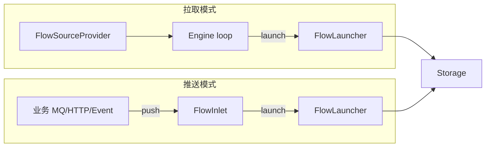

# Flow 推送模式设计

## 一、目标与现状

- **拉取模式（当前）**：业务实现 `FlowSourceProvider<T>`，引擎循环 `hasNextSubSource() / nextSubSource()` 与 `sub.hasNext() / sub.next()`，内部调用 `launcher.launch(item)`。数据由引擎「拉」进来。
- **推送模式（新增）**：业务在 MQ 回调、HTTP 请求、事件监听等场景下「有数据就推」，需要由业务主动调用「注入一条」和「声明输入结束」，引擎不再拉取 Source，只暴露一个**入口（Inlet）**供业务 push。

两种模式共用同一套：`FlowLauncher`、`FlowStorage`、`FlowFinalizer`、`ProgressTracker`；差异仅在于「谁驱动 launch」与「何时标记 source 结束」。

---

## 二、推送模式语义

- 业务先**注册一个 push 任务**，获得一个 **FlowInlet&lt;T&gt;**。
- 业务在任意线程、任意时机调用 **inlet.push(item)**，等价于当前拉取模式里的一次 `launcher.launch(item)`（背压、入库、join/finalize 逻辑一致）。
- 当业务确定**不再有新数据**时，调用 **inlet.markSourceFinished()**，以便引擎在「缓存排空、活跃消费归零」后完成 `getCompletionFuture()`。
- 业务可通过 **inlet.getProgressTracker()**、**inlet.getCompletionFuture()** 做观测与等待；需要提前结束时可调用 **inlet.stop(force)**。

---

## 三、接口与引擎改动

### 3.1 新增：`FlowInlet<T>`

**位置**：`com.lrenyi.template.core.flow.FlowInlet`（与 FlowJoiner、ProgressTracker 同包）

职责：对业务暴露「推送 + 结束 + 观测 + 停止」，内部委托给已创建的 `FlowLauncher` 与 `ProgressTracker`。

```java
public interface FlowInlet<T> {

    /** 推送一条数据，语义同 Launcher.launch(item)；可能因背压阻塞。 */
    void push(T item);

    /** 声明输入已截止，不再 push；完成后 getCompletionFuture() 将在缓存排空后完成。 */
    void markSourceFinished();

    /** 进度追踪（快照、完成率、Stuck 等）。 */
    ProgressTracker getProgressTracker();

    /** 任务完成：markSourceFinished 已调用且活跃消费归零后完成。 */
    CompletableFuture<Void> getCompletionFuture();

    /** 停止任务（不再接收 push）；force 为 true 时强制清空缓存。 */
    void stop(boolean force);
}
```

实现类（如 `FlowInletImpl<T>`）持有 `FlowLauncher<T>` 与 `ProgressTracker`，`push(item)` 委托 `launcher.launch(item)`，`markSourceFinished()` 委托 `tracker.markSourceFinished(jobId)`，其余委托对应 getter/stop。

### 3.2 引擎新增入口：`startPush`

**位置**：[FlowJoinerEngine](template-core/src/main/java/com/lrenyi/template/core/flow/FlowJoinerEngine.java)

- **方法**：`<T> FlowInlet<T> startPush(String jobId, FlowJoiner<T> joiner, TemplateConfigProperties.JobConfig jobConfig)`  
  - 创建 `DefaultProgressTracker(jobId, flowManager)`，**不**设置 totalExpected（保持 -1）。  
  - 调用 `flowManager.createLauncher(jobId, joiner, tracker, jobConfig)` 得到 `FlowLauncher<T>`。  
  - **不**调用 `joiner.sourceProvider()`，不启动任何拉取循环。  
  - 构造并返回 `FlowInlet<T>`（实现内持有该 launcher 与 tracker）。

- 推送模式下 **FlowJoiner.sourceProvider()** 不会被调用；业务若只做推送，可实现为返回「空 Provider」（如 `FlowSourceAdapters.emptyProvider()`，见下），或直接 `throw new UnsupportedOperationException("push only")`。

### 3.3 可选：空 Provider 工具

**位置**：[FlowSourceAdapters](template-core/src/main/java/com/lrenyi/template/core/flow/source/FlowSourceAdapters.java)

- 新增 **`static <T> FlowSourceProvider<T> emptyProvider()`**：`hasNextSubSource()` 恒为 false，`nextSubSource()` 抛 `NoSuchElementException`，`close()` 空实现。  
- 推送专用 Joiner 的 `sourceProvider()` 可返回 `FlowSourceAdapters.emptyProvider()`，避免未实现的 source 被误用于 `run()`。

---

## 四、ProgressTracker 完成条件修正（推送必须）

当前 [DefaultProgressTracker](template-core/src/main/java/com/lrenyi/template/core/flow/impl/DefaultProgressTracker.java) 的 `checkCompletion()` 仅在下式成立时完成：

```java
sourceFinished && totalExpected != -1 && terminated.sum() >= totalExpected
```

推送模式通常 **不设 totalExpected**（为 -1），因此 completion 永远不会触发。需与接口注释「markSourceFinished 已调用 且 当前活跃许可(Consumer)归零」对齐：

- **完成条件**：`sourceFinished` 为 true，且满足下列之一：  
  - `totalExpected != -1 && terminated.sum() >= totalExpected`（按总量完成），或  
  - `activeConsumers.sum() == 0`（按「排空」完成，用于推送或未知总量）。

即：在 `checkCompletion()` 中增加分支，当 `totalExpected == -1` 时，若 `sourceFinished && activeConsumers.sum() == 0` 也执行 `completionFuture.complete(null)` 并设置 `endTimeMillis`。

---

## 五、数据流对比



两种模式在 `FlowLauncher` 及之后的 Storage / Finalizer / Tracker 完全一致，仅「谁调用 launch」与「何时 markSourceFinished」不同。

---

## 六、实现清单

1. **DefaultProgressTracker.checkCompletion()**：在 `totalExpected == -1` 时，若 `sourceFinished && activeConsumers.sum() == 0` 则完成 completionFuture 并设置 endTimeMillis。  
2. **FlowSourceAdapters.emptyProvider()**：新增空 Provider 静态方法。  
3. **FlowInlet 接口**：定义 push、markSourceFinished、getProgressTracker、getCompletionFuture、stop。  
4. **FlowInletImpl**（或引擎包内实现）：持有 Launcher + Tracker，实现 FlowInlet 各方法。  
5. **FlowJoinerEngine.startPush(jobId, joiner, jobConfig)**：创建 Tracker（不设 total）、createLauncher、返回 FlowInlet，不调用 sourceProvider()。

---

## 七、使用方式小结

- **拉取**：`engine.run(jobId, joiner, tracker, jobConfig)` 或 `run(jobId, joiner, total, jobConfig)`；业务实现 `sourceProvider()`。  
- **推送**：`FlowInlet<T> inlet = engine.startPush(jobId, joiner, jobConfig)`；业务在回调中 `inlet.push(item)`，结束时 `inlet.markSourceFinished()`，可 `inlet.getCompletionFuture().join()` 等待排空。

同一 `FlowJoiner`（joinKey、onSuccess、onFailed 等）可只用于拉取、只用于推送、或两种入口二选一；推送专用时 `sourceProvider()` 返回 `FlowSourceAdapters.emptyProvider()` 即可。