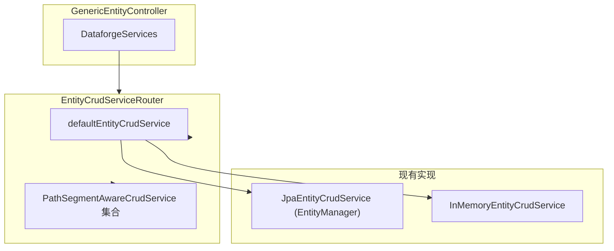
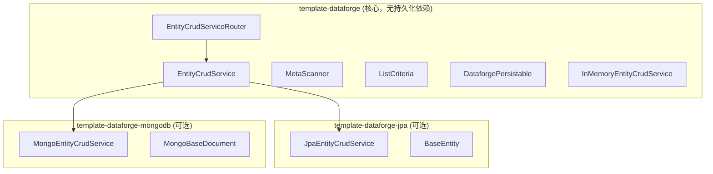

# Dataforge 多数据源设计方案（JPA + MongoDB）

> 在 Dataforge 框架中增加 MongoDB 支持，与现有 JPA 并存。不要求向后兼容。已确定：接口+多基类、独立模块、Mongo 事务、软删除与乐观锁。

## 一、当前架构概要



**核心抽象**：

- `EntityCrudService`：CRUD 接口，入参为 `EntityMeta`、`ListCriteria`
- `EntityCrudServiceRouter`：按 `pathSegment` 路由到不同实现
- `ListCriteria` / `FilterCondition`：查询条件抽象（EQ、NE、LIKE、GT 等），与具体存储无关

**当前绑定**：

- `BaseEntity`：强耦合 JPA（`@MappedSuperclass`、`@Column`、`@Id`、`@Version` 等）
- `MetaScanner`：强制继承 `BaseEntity`
- `JpaEntityCrudService`：JPQL 动态拼接

---

## 二、目标与约束

- **目标**：支持 MongoDB，与 JPA 并存
- **约束**：复用 `EntityCrudService`、`ListCriteria`、`MetaScanner` 等核心逻辑
- **不考虑**：向后兼容

---

## 三、方案设计

### 3.1 整体架构



**模块职责**：`template-dataforge` 核心无 JPA/Mongo 依赖；`template-dataforge-jpa`、`template-dataforge-mongodb`
均为可选扩展，对称结构。

### 3.2 数据源路由策略（基于 @DataforgeEntity.storage）

**路由优先级**：1）按 `pathSegment`（PathSegmentAwareCrudService）；2）按 `storage` 类型；3）默认实现。

- 业务可为任意实体提供 `PathSegmentAwareCrudService`，**覆盖**该实体的默认实现（包括 `storage=MONGO` 的实体）
- `MongoEntityCrudService` 通过 `StorageType.MONGO` 注册，处理**未**被 pathSegment 覆盖的 MONGO 实体
- 示例：`ProductsCrudService extends DelegatingEntityCrudService implements PathSegmentAwareCrudService`，
  `getPathSegment()="products"`，只重写 `create()` → `products` 走自定义逻辑，其余实体仍走 MongoEntityCrudService

```java
// 覆盖 products 实体的 create 逻辑，其余委托给 MongoEntityCrudService
@Component
public class ProductsCrudService extends DelegatingEntityCrudService implements PathSegmentAwareCrudService {
    public ProductsCrudService(@Qualifier("mongoEntityCrudService") EntityCrudService mongoService) {
        super(mongoService);
    }
    
    @Override
    public String getPathSegment() {return "products";}
    
    @Override
    public Object create(EntityMeta entityMeta, Object body) { /* 自定义创建逻辑 */ }
}
```

### 3.3 实体模型抽象与基类放置

| 层次       | 类/接口                                                | 放置位置                                                                          | 说明                                    |
|----------|-----------------------------------------------------|-------------------------------------------------------------------------------|---------------------------------------|
| 接口       | `DataforgePersistable<ID>`                          | `template-dataforge` / `com.lrenyi.template.dataforge.domain`                 | 无存储依赖，供各存储模块实现                        |
| JPA 基类   | `BaseEntity implements DataforgePersistable`        | `template-dataforge-jpa` / `com.lrenyi.template.dataforge.jpa.domain`         | JPA 专用；template-dataforge-model 依赖此模块 |
| Mongo 基类 | `MongoBaseDocument implements DataforgePersistable` | `template-dataforge-mongodb` / `com.lrenyi.template.dataforge.mongodb.domain` | Mongo 专用；依赖 template-dataforge 获取接口   |

```
template-dataforge (核心，无 JPA/Mongo 依赖)
└── domain/
    └── DataforgePersistable.java   ← 接口

template-dataforge-jpa (可选)
└── domain/
    └── BaseEntity.java             ← JPA 基类 implements DataforgePersistable

template-dataforge-mongodb (可选)
└── domain/
    └── MongoBaseDocument.java      ← Mongo 基类 implements DataforgePersistable
```

`MetaScanner` 调整为：校验「实现 `DataforgePersistable`」，不再强制继承 `BaseEntity`。

### 3.4 已确定决策

| 决策项          | 选定方案                                                                                         |
|--------------|----------------------------------------------------------------------------------------------|
| 实体基类策略       | **A. 接口 + 多基类**：`DataforgePersistable` + `BaseEntity` / `MongoBaseDocument`                  |
| 模块组织         | **A. JPA 与 Mongo 均为独立模块**：`template-dataforge-jpa`、`template-dataforge-mongodb`              |
| JPA 查询框架     | **Spring Data JPA**：JpaRepository + JpaSpecificationExecutor，FilterCondition → Specification |
| MongoDB 查询框架 | **MongoTemplate**：FilterCondition → Criteria → Query，适用于动态条件                                 |
| MongoDB 事务   | **A. 显式支持**：写操作使用 `@Transactional`（需副本集）                                                     |
| 软删除与乐观锁      | **A. 二者都支持**：`MongoBaseDocument` 含 `deleted`、`version`，查询过滤软删，更新校验版本                         |

### 3.5 @DataforgeEntity.storage() 实现规格

**1. 新增 StorageType 枚举**（`annotation/StorageType.java`）

```java
public enum StorageType {
    JPA,
    MONGO
}
```

**2. @DataforgeEntity 增加 storage 属性**

```java
StorageType storage()

default StorageType.JPA;
```

**3. EntityMeta 增加 storageType**

```java
private StorageType storageType = StorageType.JPA;
```

**4. MetaScanner.buildEntityMeta() 中**

```java
meta.setStorageType(ann.storage());
```

**5. EntityCrudServiceRouter 扩展**

- 构造函数增加参数：`Map<StorageType, EntityCrudService> storageTypeToDelegate`
- `target()` 逻辑：1）`pathSegment` 在 pathSegmentToDelegate 中 → 返回；2）`storageType` 在 storageTypeToDelegate 中 →
  返回；3）否则 defaultService

**6. DataforgeAutoConfiguration.entityCrudService()**

- 定义接口 `StorageTypeAwareCrudService extends EntityCrudService`，方法 `StorageType getStorageType()`
- 注入 `List<StorageTypeAwareCrudService>`，构建 `Map<StorageType, EntityCrudService>`
- Mongo 模块：`MongoEntityCrudService implements StorageTypeAwareCrudService`，`getStorageType()` 返回 `StorageType.MONGO`

**7. 使用示例**

```java

@DataforgeEntity(pathSegment = "products", displayName = "商品", storage = StorageType.MONGO)
public class Product extends MongoBaseDocument<String> { ...
}
```

### 3.6 JPA 实现要点（Spring Data JPA）

**选型**：采用 **JpaRepository + JpaSpecificationExecutor**，替代当前 EntityManager + JPQL 手写。

| 要点      | 说明                                                                        |
|---------|---------------------------------------------------------------------------|
| 动态条件    | `FilterCondition` 通过 `Specification` 转 `CriteriaBuilder`，比 JPQL 拼接更清晰、可维护 |
| 基础 CRUD | `JpaRepository.findById`、`save`、`deleteById` 等                            |
| 分页排序    | ` findAll(Specification, Pageable)` 原生支持                                  |
| 扩展      | 复杂查询可配合 `@Query` 或组合 Specification                                        |

### 3.7 MongoDB 实现要点（Spring Data MongoDB）

**选型**：采用 **MongoTemplate**，而非 MongoRepository。

| 要点      | 说明                                                                                                                        |
|---------|---------------------------------------------------------------------------------------------------------------------------|
| 选型原因    | MongoRepository 偏向方法名查询与 @Query，无 `findAll(Query)`；MongoTemplate 支持 `find(Query, Class)`，适合将 FilterCondition 动态转 Criteria |
| 动态条件    | `FilterCondition` 的 Op 映射为 `Criteria`（EQ→`is`，LIKE→`regex`，IN→`in` 等），构建 `Query` 后调用 `mongoTemplate.find()`               |
| 分页      | `Query.skip().limit()` + `mongoTemplate.count(Query, Class)`                                                              |
| 基础 CRUD | `findById`、`save`、`remove` 等 MongoTemplate 方法                                                                             |

- **模块**：`template-dataforge-mongodb`，依赖 `spring-boot-starter-data-mongodb`（optional）
- **实现**：`MongoEntityCrudService` 实现 `StorageTypeAwareCrudService`
- **主键**：支持 `ObjectId`、`String`、`Long`，与 `EntityMeta.primaryKeyType` 一致
- **软删除**：list/get 默认加上 `deleted = false` 条件
- **乐观锁**：update/updateBatch 前按 id 查出现有文档，比较 `version`，不一致则抛异常
- **事务**：create/update/delete/deleteBatch/updateBatch 标注 `@Transactional`

---

## 四、潜在问题与改进建议

### 问题 1：template-dataforge-model 模块的依赖

**现状**：RBAC 实体（Permission、Role、RolePermission、UserRole、OperationLog）使用 JPA 注解并继承 BaseEntity，当前 model 依赖
JPA。

**分析**：RBAC 为典型关系型数据（角色-权限多对多），放 Mongo 场景少。计划中 model 依赖 `template-dataforge-jpa` 即可。

**结论**：**存在，但当前方案可接受**。若未来需要 Mongo 版 RBAC，再拆为 model-api + model-jpa + model-mongodb。

---

### 问题 2：跨存储查询

**场景**：一次请求需同时查 JPA 和 Mongo 的数据（如 products + users 合并列表）。

**分析**：`EntityCrudService` 按单实体设计，单次调用只处理一个 `EntityMeta`。跨存储关联、聚合需在业务层组合多次调用。

**结论**：**存在，建议明确不支持**。业务层自行编排多次 CRUD 调用或编写自定义 Controller/Service。

---

### 问题 3：审计字段的差异

**分析**：`DataforgePersistable` 已约定语义字段：`createTime`、`updateTime`、`createBy`、`updateBy`。JPA 用 `@CreatedBy`、
`@LastModifiedBy` 等；Mongo 可用 `@CreatedDate` 或手动填充。接口只约束字段名与语义，具体注解由各基类实现。

**结论**：**无实质冲突**。接口定义契约，各基类负责自身注解与填充逻辑。

---

### 问题 4：索引管理

**分析**：JPA 用 `@Table(indexes)`，Mongo 用 `@Document` 的 indexes 或 `MongoTemplate.createIndex()`。索引策略与存储强相关。

**结论**：**存在，由各存储模块自行处理**。不在核心抽象中统一索引配置。

---

### 问题 5：MongoDB 分页性能（skip/limit）

**分析**：`skip` 在大偏移量时性能差。基于 `_id` 的游标分页（keyset pagination）更适合大数据量。

**结论**：**存在，建议作为后续增强**。首版使用 skip/limit；后续可在 `ListCriteria` 或 Mongo 实现中支持游标参数（如
`cursorId`、`lastId`）。

---

## 五、实施任务与 Todo 清单

| #  | Todo                                                                                | 说明                                                                            |
|----|-------------------------------------------------------------------------------------|-------------------------------------------------------------------------------|
| 1  | 新增 DataforgePersistable 接口，从 template-dataforge 移除 JPA 相关代码                         | 接口定义 id、createTime、updateTime 等语义；核心模块无 JPA 依赖                                |
| 2a | 新建 template-dataforge-jpa 模块（pom、包结构）                                               | 父 pom 加入模块，创建基础包                                                              |
| 2b | 迁出 BaseEntity 到 jpa 模块并实现 DataforgePersistable                                      | 保留 JPA 注解，实现接口                                                                |
| 2c | 迁出 JpaEntityCrudService，改用 JpaRepository + Specification 实现                         | FilterCondition → Specification，替代 JPQL                                       |
| 2d | 迁出 JpaEntityCrudServiceAutoConfiguration、JpaDataforgeEntityScanConfiguration        | 自动配置与实体扫描                                                                     |
| 2e | template-dataforge-model 改为依赖 template-dataforge-jpa                                | 调整 model 的 pom 依赖                                                             |
| 3  | MetaScanner：校验 DataforgePersistable，inferPrimaryKeyType 兼容多基类                       | 移除强制继承 BaseEntity；主键推断兼容 BaseEntity、MongoBaseDocument                         |
| 4a | 新增 StorageType 枚举、@DataforgeEntity(storage)、EntityMeta.storageType                  | 注解与元数据                                                                        |
| 4b | 定义 StorageTypeAwareCrudService，扩展 EntityCrudServiceRouter 支持 storageType 路由         | 路由优先级：pathSegment → storageType → default                                     |
| 4c | DataforgeAutoConfiguration 注入 StorageTypeAwareCrudService 并构建 storageTypeToDelegate | 组装 Router                                                                     |
| 5  | 新建 template-dataforge-mongodb 模块                                                    | 父 pom 加入模块声明                                                                  |
| 6  | 实现 MongoBaseDocument                                                                | 含 id、createTime、updateTime、createBy、updateBy、deleted、remark、version，@Document |
| 7  | 实现 MongoEntityCrudService                                                           | FilterCondition→Criteria、软删、乐观锁、事务                                            |
| 8  | MongoEntityCrudServiceAutoConfiguration 注册 StorageTypeAwareCrudService(MONGO)       | 自动配置                                                                          |
