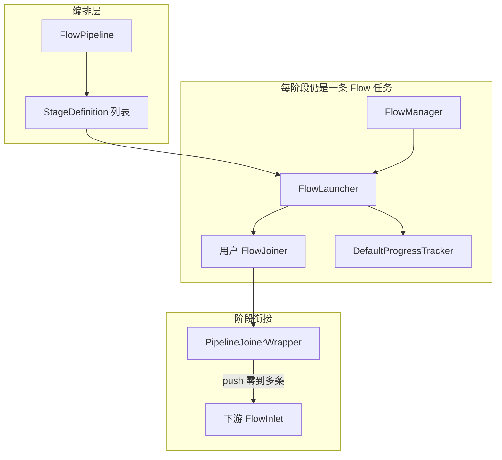
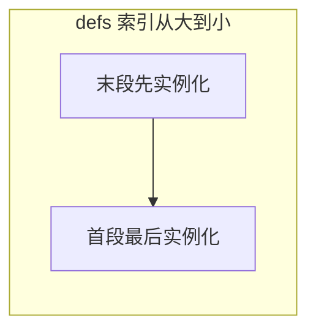
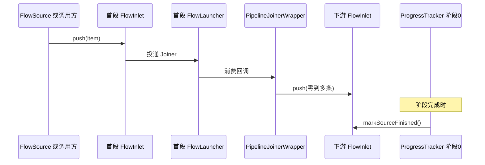

# FlowPipeline 架构与运行时流程

本文说明 **`FlowPipeline` 在现有 Flow 引擎中的位置**、**阶段如何被构建与连接**、以及 **数据与完成信号如何沿管道流动**。实现以 `template-flow` 模块源码为准。

**用法与示例**（配置、Builder 调用方式）：[Flow 流聚合使用指导](../guides/flow-usage-guide.md)、[FlowPipeline 使用指南](../guides/flow-pipeline-guide.md)。

---

## 1. 定位与边界

`FlowPipeline` 是 **编排层**：在 **不替换** `FlowManager`、`FlowLauncher`、`FlowJoiner` 的前提下，把 **多条单任务流水线** 按声明顺序（及 fork / aggregate / sink）接成一条 **逻辑管道**。

- **每一常规阶段**对应 **一个** `FlowLauncher` 实例，内部仍由用户提供的 `FlowJoiner` 完成存储、配对、背压等语义。
- **阶段之间**通过 **`PipelineJoinerWrapper`** 把「本段 Joiner 产出」转为对 **下一段 `FlowInlet` 的 `push`**，从而在异步边界上衔接类型与条数（`transformer` 产生零到多条）。
- **全局进度**由 **`PipelineProgressTracker`** 聚合各子阶段 `ProgressTracker`，对外暴露为管道级 `ProgressTracker`。

### 1.1 Builder 阶段与引擎内部的「生产—驻留—消费」

容易混淆的两套概念建议分开记：

| 概念 | 含义 |
| --- | --- |
| **Builder 里的「阶段」** | 你在管道上每链一次 `nextStage` / `nextMap` / `aggregate` / `sink`，就多 **一段** 编排：通常对应 **一个** `FlowJoiner` + **一个** `FlowLauncher` + **一段** 存储后端。 |
| **引擎内部的「三态」** | 对 **每一段** 里的每条数据，引擎都会走 **入站（生产侧写入存储）→ 在存储中驻留/配对 → 出站消费（触发 `onPairConsumed` / `onSingleConsumed` 等）**。这是 **单段内部** 的物理过程，**不是** 三个独立的 Builder 阶段。 |

因此：**「生产 + 缓存（驻留）+ 消费」描述的是每一段内部的流控与存储语义**（与 `ProgressTracker` 上的生产许可、inStorage、消费释放等信号一致），**不是**「三个阶段 = 三次 `nextStage`」。只有当你 **显式** 写了多段 Builder，才会有多段 **串联** 的业务步骤；每一段内部仍各自包含上述三态。

---

## 2. 构建顺序：为何从末段向首段、为何最后 reverse

`FlowPipelineImpl` 在 **`buildStagesRecursive`** 中按 **`StageDefinition` 列表从后往前**（索引从大到小）迭代：每一段构造时，**下游** 已是前面迭代得到的 **`currentChainHead`**（即下一段入口的 `FlowInlet`）。因此天然形成 **「本段 Launcher → 本段 Inlet → … → Sink」** 的指针链，无需二次链接。

- **普通阶段**：用 `PipelineJoinerWrapper` 包装用户 `FlowJoiner`，并把 wrapper 的下游设为 **`currentChainHead.push`**。
- **Fork**：对每个分支递归得到子链的 **首 Inlet**；当前 fork 节点再包一层 **合成 `FlowInlet`**，在 `push` / `markSourceFinished` 时向 **各分支首 Inlet** 以及 **可选的 `finalNext`（主链延续）** 广播。

递归结束后，实现里对 **`launchers`** 与 **`PipelineProgressTracker` 内子 tracker 列表** 执行 **`Collections.reverse`**，使 **列表顺序与业务上的「首段 → 末段」一致**，从而 **`startPush` 可用 `launchers.get(0)` 作为首段**。

---

## 3. Fork 节点的数据与完成信号

Fork 的合成入口在一次 `push` 时可能：

1. 向 **每个分支** 的子链首 Inlet `push` 同一条元素；
2. 若构建时仍存在 **主链下游**（`finalNext != null`），再向 **`finalNext` `push` 同一条元素**。

`markSourceFinished` 同样 **广播** 到各分支（及可选主链）。是否「扇出后仍走主链」由构建结果决定，**契约与使用场景**应在指南中写清（参见 [flow-pipeline-guide](../guides/flow-pipeline-guide.md)）。

---

## 4. 运行时主流程

### 4.1 拉取模式 `run`

1. `startPush(flowConfig)` 懒初始化阶段链，得到 **首段 `FlowInlet<I>`**。
2. 从 `FlowSource` 顺序读元素，对每个元素调用 **`inlet.push`**。
3. 数据源结束后调用 **`inlet.markSourceFinished()`**，表示上游不再产生数据。

### 4.2 推送模式 `startPush`

仅初始化并返回首段 `FlowInlet`，由调用方自行 `push` / `markSourceFinished`。

### 4.3 阶段完成向下游传播

每一阶段使用 **`DefaultProgressTracker`**。当该阶段 **`getCompletionFuture()`** 完成时，`FlowPipelineImpl` 注册 **`thenRun`**，调用 **下游阶段入口** 的 **`markSourceFinished()`**，从而在引擎语义下传播「本段已结束、下游可收口」的信号，与背压与完成条件配合。

---

## 5. 阶段类型（框架语义）

| 类型 | 作用 |
| --- | --- |
| **常规阶段** | 用户 `FlowJoiner` + 构建期装配的 **`PipelineStageDispatch`**（内含 `transformer` 语义）。 |
| **map** | **`nextMap`** + **`MapOperatorJoiner`**：每条唯一 `joinKey`，映射在 `transformer` 中完成。 |
| **aggregate** | `AggregationJoiner` 攒批；定时/满批通过 **`PipelineEmitter`** 与 wrapper 的 **`forwardDirect`** 进入下游。 |
| **sink** | `SinkJoiner` 作为终端，在消费回调中执行业务 `BiConsumer`。 |
| **fork** | 多子链并行；见上文第 3 节。 |

---

## 6. 延伸阅读

| 文档 | 内容 |
| --- | --- |
| [Flow 流聚合使用指导](../guides/flow-usage-guide.md) | 单任务 Flow、Joiner、配置与通用实践。 |
| [FlowPipeline 使用指南](../guides/flow-pipeline-guide.md) | 管道 API 使用说明与示例。 |
| [配置参考](../getting-started/config-reference.md) | Flow 配置项。 |
| [监控指标使用指南](../guides/metrics-guide.md) | 指标与观测。 |
